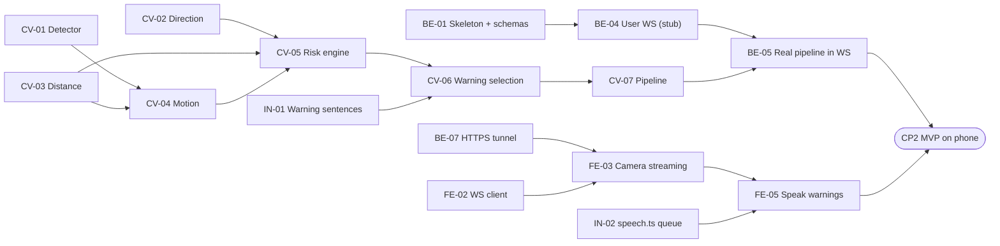

# Implementation & Integration Roadmap

**Project:** AI-Powered Vision & Guardian Navigation Assistant
**Read with:** `API_CONTRACTS.md` (what to build against) and your own story file (what to build).
**This file answers:** *what do I build, in what order, by when, and how does it get merged with everyone else's work.*

The plan assumes a **24-hour hackathon** with an integration checkpoint every 4 hours. For 36 or 48 hours, keep the same phases and stretch each one; the MVP still has to be green at **CP2**.

---

## Contents

1. The plan on one page
2. Git setup and branching rules
3. Ownership: who may edit which files
4. Interface-first: how we work in parallel from minute one
5. Dependency map
6. The standard checkpoint procedure (used at every CP)
7. Phase 0 — Setup → CP0 (H+1)
8. Phase 1 — Foundations → CP1 (H+4)
9. Phase 2 — MVP end-to-end → CP2 (H+8)  ★ most important
10. Phase 3 — Guardian core → CP3 (H+12)
11. Phase 4 — Voice features → CP4 (H+16)
12. Phase 5 — Hardening and stretch → CP5 (H+20)
13. Phase 6 — Demo freeze (H+20 to the end)
14. Handling conflicts
15. Testing and validation strategy
16. When things go wrong: slip rules and fallbacks
17. Templates and commands

---

## 1. The plan on one page

### 1.1 Timeline

| Time | Phase | Checkpoint at the end | Theme | Exit test in one line |
|---|---|---|---|---|
| H+0 → H+1 | 0 · Setup | **CP0** | Repo, branches, stubs | Every branch builds and runs with the stub modules |
| H+1 → H+4 | 1 · Foundations | **CP1** | Skeleton loop | Phone camera → backend (stub) → phone **speaks** the mock warning |
| H+4 → H+8 | 2 · MVP | **CP2 ★** | Real AI in the loop | Phone camera → **real YOLO** → direction + distance + risk → spoken warning in ≤ 1 s |
| H+8 → H+12 | 3 · Guardian | **CP3** | Guardian dashboard, alerts, emergency | Guardian sees the live view, hazards and emergencies, and can acknowledge them |
| H+12 → H+16 | 4 · Voice features | **CP4** | Ask AI, OCR, guardian messages, map | The full demo scenario (vision PDF §17) runs end-to-end |
| H+16 → H+20 | 5 · Hardening | **CP5** | Stretch features + fallbacks | Release candidate. Feature freeze |
| H+20 → end | 6 · Freeze | — | Rehearse, fix, record backup | 3 clean rehearsals on the real network |

Each checkpoint is a **45-minute timebox**. Phase lengths above include it.

### 1.2 Story-to-phase matrix (the "who builds what by when" table)

Order **within a cell** is the order to build in. **Bold** = critical path (other people are waiting on it).

| Phase → CP | Coder 1 · `frontend-ui` | Coder 2 · `ai-core` | Coder 3 · `backend-api` | Coder 4 · `voice-ocr` | Member 5 · `qa-docs` |
|---|---|---|---|---|---|
| **0 → CP0** | Vite skeleton (start of FE-01) | Stub `vision/pipeline.py` | Repo, branches, protection, **skeleton + `schemas.py` (start of BE-01)** | Stub `phrases.py`, `gemini.py`, `reader.py`, **stub `speech.ts`** | **QA-01** mocks |
| **1 → CP1** | **FE-01**, **FE-02**, **FE-03**, FE-04 (basic) | **CV-01**, **CV-02**, **CV-03** | **BE-01**, BE-02, **BE-04** (stub), BE-03 (in-memory), **BE-07** | **IN-01**, **IN-02** (desktop), IN-03 | QA-02, QA-03, QA-04 |
| **2 → CP2 ★** | FE-04 (finish), **FE-05**, FE-06 | **CV-04**, **CV-05**, **CV-06**, CV-08, **CV-07**, CV-09 | **BE-05**, BE-06, BE-09 *(P1, after P0 is green locally)* | IN-02 (on phone), IN-04 *(P1)* | QA-05, helps CV-09 + distance measurements |
| **3 → CP3** | FE-07, FE-08, FE-11, FE-09 | CV-11, CV-10, distance tuning | BE-08, BE-13, BE-10 | IN-05, IN-06 | Guardian Postman tests, deck outline (QA-06) |
| **4 → CP4** | FE-10, FE-13, FE-14 | Performance, accuracy table, bug fixes | BE-11, BE-12 | IN-07, FE-12 *(taken over from C1)*, IN-08 | QA-07 demo script, full regression |
| **5 → CP5** | Hardening; then P2 pick (FE-15, FE-17, or FE-16 only if track D) or fixes | Hardening; then P2 pick (CV-12) or fixes | Hardening; then P2 pick (BE-14, BE-16, or BE-15 only if track D) or fixes | Hardening; then P2 pick (IN-09, IN-10, IN-11) or fixes | QA-08 backup video, deck final |
| **Not planned** | — | CV-13, CV-14 (need training/benchmark time a 24 h event does not have) | BE-17 (real auth) | — | — |
| **6 · freeze** | Bug fixes only | Bug fixes only | Bug fixes only | Bug fixes only | Rehearsals, timing |

**Rebalancing note:** FE-12 (Ask AI / Read Text controls) moves from Coder 1 to Coder 4. Coder 1 carries both screens and is the most loaded person in Phases 3–4, and FE-12 is mostly voice logic anyway. Coder 4 builds it as a self-contained component in `frontend/src/features/voice/` (Coder 4's folder), and Coder 1 just mounts it on the user page.

### 1.3 Member 5 (QA & Presentation) stories

The story files cover the four coders. These are Member 5's, referenced in the matrix above. The step-by-step, non-technical version is **`06_MEMBER5_QA_AND_PRESENTATION_PLAN.md`**, and the ready-made mocks and Postman files are in `member5-starter-kit/`.

| ID | Story | Phase |
|---|---|---|
| **QA-01** | Commit the mock JSON from contract §13 to `frontend/src/mocks/` and `backend/tests/fixtures/`. Coder 1 is blocked until this lands. | 0 |
| QA-02 | Postman collection: every REST endpoint in contract §7 (happy path + one error case), and Postman WebSocket requests for `/ws/user` (`hello`, `frame`, `ping`). Environment variables for `localhost` and the tunnel URL. | 1, grows every phase |
| QA-03 | Test asset pack: 20 photos (street, corridor, people at known distances, signs, room numbers) + the golden sentence sheet from contract §13.7 as a spreadsheet. | 1 |
| QA-04 | Smoke-test checklists, one per checkpoint (copy them from sections 8–12 of this file into the tracker). | 1 |
| QA-05 | Latency and fps measurement on the demo laptop and phone; tape-measure distance accuracy runs with Coder 2. | 2 |
| QA-06 | Pitch deck outline: problem → live demo → architecture → accuracy table → privacy → future scope. | 3 |
| QA-07 | Scripted demo run sheet (who stands where, what is said, what the judges should notice) + full regression run. | 4 |
| QA-08 | Record a backup demo video of the full scenario; finalize the deck. | 5 |

---

## 2. Git setup and branching rules

### 2.1 Branches

| Branch | Owner | Who pushes | Purpose |
|---|---|---|---|
| `main` | Whole team | **Nobody pushes directly.** Changes arrive only by PR from `integration` | Always demoable. Every checkpoint is tagged here |
| `integration` | Integration Captain (Coder 3) | Only merges from feature branches, plus small labelled glue fixes during a checkpoint | Where branches meet and get tested together |
| `frontend-ui` | Coder 1 | Coder 1 | User app, guardian dashboard |
| `ai-core` | Coder 2 | Coder 2 | `backend/vision/`, `backend/safety/` |
| `backend-api` | Coder 3 | Coder 3 | FastAPI, realtime, DB, contract file |
| `voice-ocr` | Coder 4 | Coder 4 | Speech, OCR, Gemini, maps, `speech.ts`, `features/voice/` |
| `qa-docs` | Member 5 | Member 5 | Mocks, Postman collection, test assets, deck notes |

> **Why `voice-ocr` and not `integration` for Coder 4:** `integration` is already the merge-testing branch. Giving Coder 4's work a different name avoids someone pushing feature code to the shared test branch by accident.

### 2.2 Rules (put these in the README)

1. **Never push to `main`.** Branch protection enforces it (section 2.3).
2. Work only on your own branch. Commit **small and often**, one story per commit or a few commits per story.
3. Commit message format: `[CV-03] add pinhole distance estimation`. The story ID makes the checkpoint report automatic: `git log --oneline main..ai-core`.
4. Push your branch at least every hour, so a dead laptop never loses more than an hour.
5. **No force-push** on any shared branch. Use `git merge`, not `git rebase`, on branches others have pulled.
6. After every checkpoint, **merge `main` back into your branch** before you continue (section 6, step 10). This is what stops branches drifting apart.
7. PRs from `integration` into `main` use **"Create a merge commit"**, never "Squash". A squash rewrites history, and the next time everyone merges `main` back into their branch they get conflicts with their own code.
8. Half-finished features are merged **behind a feature flag** (section 4.3), not held back on a branch for many hours.

### 2.3 One-time GitHub settings (Coder 3, Phase 0)

- **Settings → Branches → Add rule for `main`:** require a pull request before merging; require 1 approval; block force pushes; block deletion. Turn on "Require status checks" only if CI is set up (section 15.4).
- **Rule for `integration`:** block force pushes and deletion (direct pushes allowed, for glue fixes).
- **Settings → General → Pull Requests:** enable "Allow merge commits"; disable "Allow squash merging" and "Allow rebase merging", so nobody can pick the wrong one.
- Add a `CODEOWNERS` file (section 3.2) so the right person is auto-requested for review.

### 2.4 How the branches flow

```
            CP0      CP1      CP2      CP3      CP4      CP5
main     ───●────────●────────●────────●────────●────────●──── (tag cp0..cp5, v1.0-demo)
            ▲        ▲        ▲        ▲        ▲        ▲
            │ PR     │ PR     │ PR     │ PR     │ PR     │ PR
integration ●────────●────────●────────●────────●────────●
           ↗↗↗↗↗    ↗↗↗↗↗    ↗↗↗↗↗    ...   (merge in fixed order at each CP)
frontend-ui  ai-core  backend-api  voice-ocr  qa-docs
     ↑ after each CP, every feature branch merges main back in ↑
```

---

## 3. Ownership: who may edit which files

### 3.1 Folder ownership

Conflicts mostly happen when two people edit the same file. Our folder layout (contract §8.1) is designed so that almost never happens.

| Path | Owner | Others may… |
|---|---|---|
| `docs/API_CONTRACTS.md` | Coder 3 | Request changes (section 14.2) |
| `backend/main.py`, `config.py`, `schemas.py`, `realtime/`, `db/`, `tools/` | Coder 3 | Read only |
| `backend/vision/`, `backend/safety/` | Coder 2 | Read only |
| `backend/speech/`, `backend/ocr/`, `backend/ai/`, `backend/navigation/` | Coder 4 | Read only |
| `backend/tests/<area>/` | The area owner | Member 5 may add test cases |
| `backend/tests/fixtures/`, `postman/`, `docs/qa/`, `docs/pitch/` | Member 5 | Add files |
| `frontend/` (everything else) | Coder 1 | Read only |
| `frontend/src/types/contracts.ts` | Coder 1 | Request changes |
| `frontend/src/services/speech.ts`, `frontend/src/features/voice/` | Coder 4 | Read only |
| `frontend/src/mocks/` | Member 5 | Coder 1 may add mocks |

### 3.2 `CODEOWNERS` (replace the handles)

```
/docs/API_CONTRACTS.md          @coder3
/backend/                       @coder3
/backend/vision/                @coder2
/backend/safety/                @coder2
/backend/speech/                @coder4
/backend/ocr/                   @coder4
/backend/ai/                    @coder4
/backend/navigation/            @coder4
/frontend/                      @coder1
/frontend/src/services/speech.ts @coder4
/frontend/src/features/voice/   @coder4
/frontend/src/mocks/            @member5
/backend/tests/fixtures/        @member5
/postman/                       @member5
```

### 3.3 Shared files and how to touch them without conflicts

| File | Rule |
|---|---|
| `backend/requirements.txt` | Created in Phase 0 and **never edited again**. It only contains `-r requirements/base.txt`, `-r requirements/vision.txt` and `-r requirements/integrations.txt`. Each owner edits only their own file |
| `backend/requirements/*.txt` | Pin exact versions (`ultralytics==x.y.z`). Only `vision.txt` may list OpenCV, and only one OpenCV package (section 14.3) |
| `frontend/package.json` | Coder 1 only. Anyone needing a package asks Coder 1 |
| `package-lock.json` | Never hand-merge. On conflict: take `integration`'s version, run `npm install`, commit the result |
| `backend/.env.example`, `frontend/.env.example` | One labelled block per owner (`# --- Coder 2: vision ---`). Add lines only inside your block. **Real secrets never go in git** |
| `README.md` | One section per owner, same rule |
| `backend/main.py` router registration | Coder 3 only. If you need a route, message Coder 3 with the function to call |

---

## 4. Interface-first: how we work in parallel from minute one

The problem with "everyone builds in isolation, merge every 4 hours" is that the first merge reveals that nothing fits. We avoid that with three habits.

### 4.1 Stubs with the real signatures, committed in Phase 0

Before writing any real logic, each owner commits a **stub** of every module others will import, with the **exact signature from the contract** and a body that returns mock data. These are merged to `main` at CP0. From then on, everyone imports the real module path from the start, and each checkpoint simply replaces stub bodies with real ones.

| Stub (owner) | Signature (contract) | Stub behaviour |
|---|---|---|
| `vision/pipeline.py` — `VisionPipeline.process()` (C2) | §8.2 | Returns `frame_result.vehicle_right` from the fixtures, with `frame_id` and timestamps filled in |
| `speech/phrases.py` — `build_warning_message()`, `build_short_text()`, `format_distance()`, `describe_scene_fallback()` (C4) | §8.3 | Simple f-string templates |
| `ai/gemini.py` — `answer_question()`, `interpret_ocr()` (C4) | §8.3 | Returns `("I can see a person ahead.", "fallback")` |
| `ocr/reader.py` — `read_text()` (C4) | §8.3 | Returns `{"text": "ROOM 204", "lines": [...]}` |
| `schemas.py` (C3) | §4 | **Real** from the start: Pydantic models for every contract model |
| `frontend/src/services/speech.ts` (C4) | §9.1 | `speak()` calls `speechSynthesis.speak()` directly; other methods are no-ops |
| `frontend/src/types/contracts.ts` (C1) | §9 | **Real** from the start |

### 4.2 Mocks on the consumer side

- Coder 1 runs with `VITE_USE_MOCKS=true` until CP1, so the UI never waits for the backend.
- Coder 3 runs with `PIPELINE=stub` until CP2, so the socket never waits for YOLO.
- Coder 2 runs the webcam script with no server, so vision never waits for the backend.

### 4.3 Feature flags

Anything not ready by a checkpoint is merged **switched off** instead of held back. Merging early keeps conflicts small; the flag keeps `main` demoable.

```
# backend/.env
PIPELINE=stub|real
FEATURE_GUARDIAN=false
FEATURE_ALERTS_DB=false
FEATURE_ASK=false
FEATURE_OCR=false
FEATURE_NAVIGATION=false

# frontend/.env
VITE_USE_MOCKS=true
VITE_FEATURE_GUARDIAN=false
VITE_FEATURE_VOICE_CONTROLS=false
VITE_FEATURE_MAP=false
```

A flag goes to `true` in `.env.example` in the same checkpoint where its exit test passes.

---

## 5. Dependency map

### 5.1 Story dependencies, and how to avoid waiting

"Depends on" means the story cannot be **finished and verified** without the other one. The workaround column says how to **start** it anyway.

| Story | Depends on | Why | Work around it until then |
|---|---|---|---|
| FE-01 | QA-01 | Mock replay needs fixtures | Copy JSON straight from contract §13 |
| FE-03 | BE-04, BE-07 | Needs a real socket; the phone needs HTTPS | Mock client on a laptop (`localhost` counts as secure) |
| FE-05 | IN-02, FE-02 | Speaks via `speech.ts` | The Phase-0 stub `speech.ts` |
| FE-06 | FE-03 | Overlay sits on the video | Draw on a static image with mock detections |
| FE-07, FE-08 | BE-08 | Guardian socket | Mock guardian messages (`snapshot`, `alert`, `user_status`) |
| FE-09, FE-11 | BE-10 | Alerts and emergency flow | Mock `alert`, `emergency_ack` |
| FE-10 | BE-11 (IN-08 for voice) | Message delivery | Mock `message_delivered` |
| FE-12 | IN-04, BE-12 | STT and `/ask`, `/ocr` | Hard-coded transcripts; mock responses |
| FE-13 | BE-08 | Location relay | Mock `location` stream |
| FE-14 | BE-08 | `user_status` | Mock `user_status` |
| CV-03 | Phone frames for calibration (FE-03 + BE-05 frame saving) | `focal_px` is per camera **and** per resolution | Calibrate on the laptop webcam first; recalibrate at CP2 |
| CV-04 | CV-01, CV-03 | Needs track IDs and distances | — (same owner, build in order) |
| CV-05 | CV-02, CV-03, CV-04 | Uses direction, distance, motion | Unit tests with hand-made detection dicts |
| CV-06 | CV-05, IN-01 | Warning text from `phrases.py` | Phase-0 stub `phrases.py` |
| CV-07 | CV-01–CV-06, CV-08 | Assembles everything | — |
| CV-10, CV-11 | CV-07 | Use the `FrameResult` | — |
| BE-03 | BE-09 | Sessions in Supabase | **In-memory repository** with the same function names; swap at CP3 |
| BE-04 | BE-01 | Schemas, app | — |
| BE-05 | CV-07, BE-04 | Real pipeline | `PIPELINE=stub` |
| BE-08 | BE-04, BE-03 | Hub extends the user socket | — |
| BE-10 | BE-08, BE-09, CV-11 | Persist + push + thumbnail | `snapshot_b64: null` until CV-11 lands |
| BE-12 | IN-05, IN-06, IN-07, CV-10 | Wires their functions | Phase-0 stubs |
| BE-13 | BE-09, BE-08 | Links + online state | — |
| IN-02 (on phone) | FE-03, BE-07 | Needs the phone page over HTTPS | Desktop Chrome first |
| IN-05 | CV-10 (for real input) | Grounding data | Hand-made detection lists from fixtures |
| IN-07 | IN-06 | Interprets OCR output | Typed sample strings |

### 5.2 Critical path to the MVP (CP2)

The MVP is late if **any** box on this chain is late. Protect these people's time: no non-urgent questions to Coder 2 outside checkpoints.



**Longest chain:** CV-01 → CV-03 → CV-04 → CV-05 → CV-06 → CV-07 → BE-05. That is all of Coder 2's P0 work plus one Coder 3 story. If Coder 2 is behind at CP1, Coder 4 (who has the lightest Phase 2) takes **CV-08** and the risk-rule unit tests.

### 5.3 Producer → consumer handoffs

| Producer delivers | Consumer | Expected by |
|---|---|---|
| QA-01 mocks | C1, C3 | CP0 |
| `schemas.py` (real), stubs | Everyone | CP0 |
| BE-04 stub socket + BE-07 tunnel | C1 | CP1 |
| IN-01 real sentences | C2 | CP1 |
| IN-02 real `speech.ts` | C1 | CP1 |
| CV-07 real pipeline | C3 | CP2 |
| BE-08 guardian socket | C1 | CP3 |
| CV-10 `summarize_for_llm`, CV-11 thumbnail | C3, C4 | CP3 |
| IN-05/06/07 real AI + OCR | C3 | CP3 / CP4 |
| BE-11, BE-12 endpoints | C1, C4 (FE-12) | CP4 |

---

## 6. The standard checkpoint procedure

Every checkpoint (CP0–CP5) follows these steps. Phase sections below only list what is **different**: what must be ready, what gets wired, and the exit test.

**Roles during a checkpoint**
- **Integration Captain — Coder 3.** Runs the merges on the integration machine. Coder 3 owns the backend everything else plugs into, so most integration problems show up there first.
- **Test Lead — Member 5.** Runs the smoke-test checklist and decides pass/fail.
- **Owners** — stay available; resolve conflicts and fix bugs in their own code.

**Integration machine.** Always the **demo laptop**, with the **demo phone**. Latency and calibration numbers only count when measured there.

### Step 0 · T−15 min: "Pencils down"
- Captain posts in the team chat: *"CP2 in 15 minutes."*
- Each owner finishes the current commit (do **not** start anything new), runs their own tests, and pushes their branch.
- Each owner posts a **ready report** (template in section 17.1): stories done, tests passing, stories slipped, known issues, anything others must configure.

### Step 1 · T+0: Prepare `integration`
```bash
git fetch --all
git checkout integration
git merge origin/main          # integration starts equal to the last green checkpoint
```

### Step 2 · Merge feature branches **in this fixed order**
Order: **`backend-api` → `ai-core` → `voice-ocr` → `frontend-ui` → `qa-docs`**.
Host first, then the modules it imports, then the consumers, then tests.

After **each** merge, run that layer's quick check before merging the next one, so you know exactly which merge broke the build:

| After merging | Quick check |
|---|---|
| `backend-api` | `cd backend && pytest -q -m "not slow" && python -c "import main"` |
| `ai-core` | `pytest -q tests/vision` and `python -c "from vision.pipeline import VisionPipeline"` |
| `voice-ocr` | `pytest -q tests/speech tests/ocr tests/ai` and `cd ../frontend && npx tsc --noEmit` |
| `frontend-ui` | `cd frontend && npm ci && npm run build` (this includes the type check) |
| `qa-docs` | Mocks still type-check: `npx tsc --noEmit` |

```bash
git merge --no-ff origin/backend-api -m "CP2: merge backend-api"
# quick check ...
git merge --no-ff origin/ai-core -m "CP2: merge ai-core"
# quick check ...
```

### Step 3 · Resolve merge conflicts (if any)
- **Owner rule:** the conflict is resolved by the **owner of the file** (section 3), at the integration machine, with the Captain. Nobody resolves conflicts in a file they do not own.
- Lockfiles and shared files: follow section 3.3.
- After resolving: `git add …`, `git commit`, re-run the quick check.

### Step 4 · Wire the new pieces
Flip the flags and settings listed for this checkpoint (for example `PIPELINE=real` at CP2), then start the full stack:
```bash
# terminal 1
cd backend && uvicorn main:app --host 0.0.0.0 --port 8000
# terminal 2
cd frontend && npm run dev -- --host
# terminal 3
cloudflared tunnel --url http://localhost:8000   # and the frontend tunnel, per BE-07
```

### Step 5 · Smoke test
Member 5 runs this checkpoint's checklist **in order** and marks each item pass/fail in the tracker. Also run **every previous checkpoint's exit test** (the regression rule: features never get worse).

### Step 6 · Triage failures
For each failure, find the owner with the **contract as referee**:
- Message shape differs from the contract → the **producer** fixes it.
- Shape matches the contract but the consumer breaks → the **consumer** fixes it.
- The contract is ambiguous or wrong → **Coder 3 decides in 5 minutes**, updates `API_CONTRACTS.md`, and the affected people fix.

Severity:
| Severity | Meaning | Action |
|---|---|---|
| **S1** | Breaks the MVP loop or crashes the server | Everyone stops; owner + one helper fix it now |
| **S2** | Breaks this checkpoint's new feature | Owner fixes within the timebox, or the feature flag is turned off |
| **S3** | Cosmetic or minor | Logged as an issue; fixed in the next phase |

### Step 7 · Fix
- Fixes are made **on the owner's feature branch**, pushed, and re-merged into `integration`. This keeps the owner's branch correct, so the same bug does not come back next checkpoint.
- **Exception:** trivial glue (an import path, a typo in an env name) may be committed directly on `integration` by the Captain, with the message `[CP2-fix] …`, and announced in chat.

### Step 8 · Timebox decision at T+30 min
If something is still red:
- **S2 feature:** turn its flag off and continue.
- **A branch that breaks the build:** revert that merge and ship the checkpoint without it. That owner's stories slip to the next checkpoint.
  ```bash
  git revert -m 1 <merge-commit-sha>
  ```
- **S1 in the MVP loop:** do not merge to `main`. `main` stays at the last green tag. The team swarms the S1 issue (section 16).

> The rule is "**the train leaves on time**". A checkpoint never blocks on one person.

### Step 9 · Promote to `main`
- Open a PR **`integration` → `main`**, titled `CP2: MVP end-to-end` (template in section 17.2).
- Approvals: Member 5 (tests passed) + one coder who did not run the merge.
- Merge with **"Create a merge commit"**.
- Tag it:
  ```bash
  git checkout main && git pull
  git tag -a cp2 -m "CP2 green: MVP end-to-end"
  git push origin cp2
  ```

### Step 10 · Sync back (everyone, immediately)
```bash
git checkout <your-branch>
git fetch origin
git merge origin/main
git push
```
Then post "synced" in chat and continue with the next phase. **Do not skip this step.** It is what keeps the next checkpoint small.

---

## 7. Phase 0 — Setup → CP0 (H+0 to H+1)

**Goal:** everyone can run the full repo with stubs; the process is practised once while the stakes are low.

### 7.1 Before the hackathon (environment only, if your event rules allow)
Do not write project code early if the rules forbid it, but setting up tools is normally fine:
- Python 3.11 and Node 20 on every laptop. Commit `.python-version` and `.nvmrc` at H+0.
- `tesseract-ocr` installed (Coder 4); `cloudflared` or `ngrok` installed and tested from a phone (Coder 3).
- YOLOv8n weights downloaded to every machine that runs the backend (`yolo predict model=yolov8n.pt source=bus.jpg` once). Venue Wi-Fi is often slow.
- Gemini API key created and tested with one call (Coder 4). Supabase project created (Coder 3).
- Demo phone: Chrome updated, a chest strap or lanyard for wearing it facing forward.

### 7.2 Phase 0 tasks, in order

| # | Who | Task |
|---|---|---|
| 1 | C3 | Create the GitHub repo. Push the skeleton **directly to `main`** (the only time anyone does): folder layout from contract §8.1, `docs/` with all six files, `.gitignore` (`.env`, `node_modules/`, `__pycache__/`, `*.pt`, `.venv/`), `.env.example` files with owner blocks, `requirements.txt` + `requirements/*.txt`, `CODEOWNERS`, PR template |
| 2 | C3 | Create the branches and turn on protection (section 2.3) |
| 3 | Everyone | Clone, check out your own branch, create a venv, `pip install -r backend/requirements.txt`, `npm ci` in `frontend/` |
| 4 | C1 | `npm create vite@latest` (React + TS) inside `frontend/`, Tailwind set up, `contracts.ts` written from contract §9 |
| 5 | C3 | `schemas.py` with every contract model; `main.py` with `/health` only |
| 6 | C2 | Stub `vision/pipeline.py` (section 4.1) |
| 7 | C4 | Stubs `speech/phrases.py`, `ai/gemini.py`, `ocr/reader.py`, `frontend/src/services/speech.ts` |
| 8 | M5 | **QA-01:** mocks committed to `frontend/src/mocks/` and `backend/tests/fixtures/` |
| 9 | Optional (whoever is free) | CI workflow from section 15.4 |

### 7.3 Ready for CP0 when
- [ ] Every branch is pushed with its stubs.
- [ ] `schemas.py` and `contracts.ts` exist and match the contract.
- [ ] QA-01 mocks are on `qa-docs`.

### 7.4 CP0 exit test (15 minutes, not the full 45)
- [ ] After merging everything into `integration`: `uvicorn main:app` starts, `GET /health` returns 200.
- [ ] `python -c "from vision.pipeline import VisionPipeline; from speech.phrases import build_warning_message; from ai.gemini import answer_question; from ocr.reader import read_text"` succeeds.
- [ ] `npm run build` passes; the app opens at `/user` and `/guardian` (blank pages are fine).
- [ ] PR to `main`, tag `cp0`, everyone syncs.

---

## 8. Phase 1 — Foundations → CP1 (H+1 to H+4)

**Goal:** the **skeleton loop** works on the real phone: camera → socket → (stub) result → **speech**. Real vision runs on its own, beside the loop.

### 8.1 Stories in order

**Coder 1 · `frontend-ui`**
1. **FE-01** Finish scaffold, routes, `config.ts`, mock client (mocks from QA-01).
2. **FE-02** Realtime client: envelope, reconnect, ping.
3. **FE-03** Camera capture and frame streaming with backpressure. Test against mocks on the laptop first, then against Coder 3's stub socket as soon as it is pushed.
4. **FE-04 (basic)** Start/Stop and Emergency buttons, `speech.unlock()` on first tap, aria labels. Polish comes in Phase 2.

**Coder 2 · `ai-core`**
1. **CV-01** Detector + tracking + class filter; benchmark inference time on the demo laptop. **Report the number in chat** (if it is over 100 ms, decide on `imgsz`/ONNX now, not at CP2).
2. **CV-02** Direction with boundary tests.
3. **CV-03** Distance: known-heights table, `calibrate.py`, edge-clipping, EMA. Calibrate on the laptop webcam for now.
4. Update the webcam demo script so it draws direction and distance live.

**Coder 3 · `backend-api`**
1. **BE-01** Finish config, schemas, CORS, lifespan (load YOLO through Coder 2's `Detector` stub for now), `/config`.
2. **BE-04** User socket in **stub mode**. Push this **as early as possible** (target H+2); Coder 1 is waiting on it.
3. **BE-07** HTTPS tunnel; test `wss://` from the phone on mobile data. Post the URLs in chat.
4. **BE-02** Error handlers.
5. **BE-03** Sessions using an **in-memory repository** (`db/repo.py` with the final function names; the Supabase body comes in BE-09).

**Coder 4 · `voice-ocr`**
1. **IN-01** Real sentence builder; golden set (contract §13.7) passing in `pytest`. **Push and tell Coder 2.**
2. **IN-02** Real `speech.ts` queue (interrupt, max queue, stale drop, dedupe, voice selection); test page `/dev/speech` working on desktop Chrome.
3. **IN-03** `local_tts.py` for the offline fallback demo.

**Member 5 · `qa-docs`**
1. **QA-02** Postman: `/health`, `/config`, `/sessions` (+ errors), WS `/ws/user` with a JSON `frame`.
2. **QA-03** Photo pack + golden sentence sheet.
3. **QA-04** Write the CP1 and CP2 checklists into the tracker.

### 8.2 Integration handoffs during the phase (do not wait for the checkpoint)
- As soon as BE-04 + BE-07 are pushed on `backend-api`, Coder 1 runs Coder 3's branch locally (or points at Coder 3's tunnel) to test FE-03 for real. Testing **against** someone's branch is fine; **merging** it into your own branch is not (only `main` gets merged back).
- As soon as IN-01 is pushed, Coder 2 copies nothing: the function arrives through `main` at CP1. Until then, Coder 2 keeps using the stub.

### 8.3 Ready for CP1 when
- [ ] C1: FE-01, FE-02, FE-03 done; FE-04 basic.
- [ ] C2: CV-01, CV-02, CV-03 done with unit tests; benchmark number posted.
- [ ] C3: BE-01, BE-02, BE-03 (in-memory), BE-04 (stub), BE-07 done.
- [ ] C4: IN-01 (golden set green), IN-02 (desktop), IN-03 done.
- [ ] M5: QA-02, QA-03, QA-04 done.

### 8.4 Wiring at CP1
- Backend: `PIPELINE=stub`.
- Frontend: `VITE_USE_MOCKS=false`, `VITE_API_BASE` / `VITE_WS_BASE` set to the tunnel URLs.
- The real `speech.ts` replaces the stub (it arrives through the `voice-ocr` merge).

### 8.5 CP1 exit test
- [ ] Phone opens `/user` over **HTTPS**, taps Start, hears "Vision assistant started".
- [ ] The backend log shows frames arriving at ≥ 4 fps from the phone.
- [ ] The phone **speaks** the stub warning: *"Warning. Car approaching from your right, approximately 4 meters away. Please move slightly to your left."*
- [ ] The phone does not repeat it every frame (cooldown/dedupe in `speech.ts` works on the stub stream).
- [ ] Turn Wi-Fi off and on → the client reconnects and says so.
- [ ] Postman: `/health`, `/config`, `/sessions` pass, including error cases.
- [ ] `pytest`: golden sentences, direction boundaries, distance unit tests all pass on `integration`.
- [ ] **Side demo:** Coder 2's webcam script on the demo laptop shows correct left/centre/right and distances within roughly ±30% at 2 m and 4 m.

---

## 9. Phase 2 — MVP end-to-end → CP2 ★ (H+4 to H+8)

**Goal:** the five MVP features work **live on the phone with the real model**: camera, detection, distance, direction, natural voice warning. **This is the most important checkpoint.** Tag `cp2` is your safe point for the rest of the event.

### 9.1 Stories in order

**Coder 2 · `ai-core`** (critical path, so protect this person's time)
1. **CV-04** Motion tracker.
2. **CV-05** Risk engine, rules R1–R7, table tests.
3. **CV-06** Warning selector with cooldown, escalation and the simulation test, using the real `phrases.py` (now in `main`).
4. **CV-08** Path-clear check.
5. **CV-07** `VisionPipeline.process()`: real implementation, output validated against `schemas.FrameResult` in a test.
6. **CV-09** Record the 4 test clips **on the demo phone** with Member 5; `replay.py`.
7. **Recalibrate** `focal_px` using frames captured from the phone page (see 9.2).

**Coder 3 · `backend-api`**
1. **BE-05** Real pipeline in the socket loop: one pipeline per session, `asyncio.to_thread`, latest-frame-wins, latency logging. Add `DEBUG_SAVE_FRAMES=1`, which writes every 10th received frame to `backend/debug_frames/` (git-ignored) for calibration.
2. **BE-05 load test:** `tools/replay_ws.py --clip <file>` streams a recorded clip into `/ws/user` as if it were the phone. QA and Coder 2 reuse it.
3. **BE-06** `POST /detect`.
4. **BE-09** *(P1, only once 1–3 work locally)* Supabase migration + repository bodies, behind `FEATURE_ALERTS_DB=false`.

**Coder 1 · `frontend-ui`**
1. **FE-04** Finish accessibility: aria-live region, contrast, wake lock, screen-reader test.
2. **FE-05** Speak warnings from `frame_result` through `speech.ts`; guardian-message speaking hook.
3. **FE-06** Detection overlay with zone lines and the path-clear badge.

**Coder 4 · `voice-ocr`**
1. **IN-02 on the phone:** verify unlock, voice choice and interrupt on Android Chrome (iPhone Safari too if you have one). Fix quirks.
2. Help the critical path if Coder 2 is behind: take CV-08 or the risk-rule test cases (agree in chat; the code still lives in Coder 2's folder, so commit it on `ai-core` by pairing on Coder 2's laptop, or send Coder 2 a patch).
3. **IN-04** *(P1)* STT + `parseIntent` + 25-phrase test.

**Member 5 · `qa-docs`**
1. Record clips with Coder 2 (CV-09).
2. **Distance accuracy runs:** tape measure, person and chair at 1–5 m, using the phone (for Coder 2's table and the pitch).
3. **QA-05:** latency and fps with the real pipeline, using `latency_ms` in the debug strip and the backend logs.

### 9.2 Calibration procedure (do this during Phase 2, finish before CP2)
1. Phone running the user page, backend with `DEBUG_SAVE_FRAMES=1`.
2. A person stands at **exactly 2.0 m** (tape measure) directly in front of the phone for 10 seconds.
3. Coder 2 runs `python -m vision.calibrate --frames backend/debug_frames/ --distance 2.0 --class person`.
4. Put the printed value in `backend/.env` as `CAMERA_FOCAL_PX` (and the value in `.env.example`'s comment).
5. Spot-check at 1 m and 4 m.

> The phone's frames are resized to 640 px wide before they are sent, so the laptop-webcam calibration from Phase 1 does **not** carry over. Recalibrate whenever the demo phone or the frame size changes.

### 9.3 Ready for CP2 when
- [ ] C2: CV-04 to CV-08 done; pipeline test validates against `FrameResult`; CV-09 clips recorded; phone calibration done.
- [ ] C3: BE-05 (including the replay tool), BE-06 done. BE-09 merged but flagged off is fine.
- [ ] C1: FE-04 (complete), FE-05, FE-06 done.
- [ ] C4: IN-02 verified on the phone. IN-04 merged but not wired is fine.
- [ ] M5: distance accuracy table filled in; QA-05 measurements ready.

### 9.4 Wiring at CP2
- Backend: `PIPELINE=real`, `CAMERA_FOCAL_PX=<value>`.
- Remove the Phase-0 stub fallback paths (or leave them only behind `PIPELINE=stub` for offline testing).

### 9.5 CP2 exit test (do every item with the phone worn on the chest)

| # | Scenario | Expected |
|---|---|---|
| 1 | Clear corridor | No warnings spoken; overlay badge "Path clear" |
| 2 | Person stands 2 m directly ahead | *"Person about 2 meters directly ahead."* once, repeated no more often than every 6 s |
| 3 | Same person walks to 1.5 m | Escalates to `high`, spoken immediately (escalation rule) |
| 4 | Chair 0.7 m ahead | *"Stop. Chair about 70 centimeters directly ahead."* **interrupts** any speech in progress |
| 5 | Person at far left, then far right | Spoken direction "on your left" / "on your right" matches reality |
| 6 | Person walks toward the camera from 5 m | `motion: approaching` shown on the overlay within about 1 s |
| 7 | Vehicle approaching (use `tools/replay_ws.py` with the vehicle clip; a live car is not needed) | *"Warning. Car approaching from your right, approximately … meters away. Please move slightly to your left."* |
| 8 | Latency | Frame → speech starts ≤ 1 s; `latency_ms` p95 ≤ 400 ms |
| 9 | Endurance | 5 minutes continuous at ≥ 4 fps, no crash, backend memory flat |
| 10 | Postman `/detect` | Sample photos from QA-03 return valid `FrameResult` JSON |
| 11 | Regression | Every CP1 check still passes |

**If CP2 is green:** tag `cp2`. From here on, if anything goes badly wrong, you can always demo from `cp2`.
**If CP2 is red:** read section 16.1 before doing anything else. **All P1 work pauses until CP2 is green.**

---

## 10. Phase 3 — Guardian core → CP3 (H+8 to H+12)

**Goal:** the guardian can watch the user live, sees hazards and emergencies, and can acknowledge them. Data persists in Supabase.

### 10.1 Stories in order

**Coder 3 · `backend-api`**
1. **BE-09** (finish) Supabase live; swap the in-memory repository for the real one; `FEATURE_ALERTS_DB=true` locally.
2. **BE-08** Session hub + guardian socket: `welcome`, `snapshot` and `frame_result` relay at 2/s, `location`, `user_status`, offline detection.
3. **BE-13** `GET /guardians/{id}/users`.
4. **BE-10** Hazard alerts (throttled), emergency flow (WS + REST), `ack_alert`/`PATCH`, `GET /alerts`.

**Coder 1 · `frontend-ui`**
1. **FE-07** Guardian layout + session pick-up (start against mocks until BE-08 is on `backend-api`, then test against Coder 3's branch).
2. **FE-08** Live view from snapshots, reusing the FE-06 overlay component.
3. **FE-11** Emergency long-press on the user app (+ voice trigger once IN-04 is in `main`).
4. **FE-09** Alert feed and emergency banner with acknowledge/resolve.

**Coder 2 · `ai-core`**
1. **CV-11** `make_thumbnail()` (Coder 3 needs it for BE-10).
2. **CV-10** `summarize_for_llm()` (Coder 4 needs it for IN-05 tests; Coder 3 for BE-12).
3. Distance tuning from Member 5's accuracy table; fix any CP2 S3 issues.

**Coder 4 · `voice-ocr`**
1. **IN-05** Gemini Q&A with grounding prompt, three modes, 6 s timeout and fallback. Test with `summarize_for_llm` output from saved clips.
2. **IN-06** OCR with pre-processing; run on the 10 test photos and record results.

**Member 5 · `qa-docs`**
1. Postman: `/alerts`, `/emergency`, `PATCH /alerts`, `/guardians/{id}/users`, WS `/ws/guardian`.
2. **QA-06** Pitch deck outline; put the distance accuracy table and latency numbers in.

### 10.2 Ready for CP3 when
- [ ] C3: BE-08, BE-09, BE-10, BE-13 done.
- [ ] C1: FE-07, FE-08, FE-09, FE-11 done.
- [ ] C2: CV-10, CV-11 done.
- [ ] C4: IN-05 and IN-06 work standalone (wiring happens in Phase 4).
- [ ] M5: guardian requests in Postman.

### 10.3 Wiring at CP3
- Backend: `FEATURE_GUARDIAN=true`, `FEATURE_ALERTS_DB=true`, Supabase env vars set on the integration machine; run migration `001_init.sql` on the Supabase project once (Coder 3).
- Frontend: `VITE_FEATURE_GUARDIAN=true`.

### 10.4 CP3 exit test (phone = user, laptop = guardian, ideally on different networks)
- [ ] Guardian page finds the active session and shows the live view (~2 fps) with the overlay.
- [ ] A `critical`/`high` hazard appears in the guardian feed within 2 s, with a thumbnail, and **not more than once per 10 s** per object.
- [ ] Emergency long-press on the phone → guardian banner + sound within 2 s → the phone says *"Your guardian has been notified."*
- [ ] Guardian clicks Acknowledge → the phone says the acknowledged message; the banner closes.
- [ ] Refresh the guardian page → open alerts reload from Supabase.
- [ ] Close the user tab → the guardian shows **offline** within 10 s and a `system` alert appears.
- [ ] **Regression with a guardian connected:** CP2 latency and fps are still within budget (the relay must not slow the user loop).
- [ ] Supabase switched off (wrong URL) → warnings still spoken on the phone (BE-09 rule).

---

## 11. Phase 4 — Voice features → CP4 (H+12 to H+16)

**Goal:** the complete demo story works: ask the AI, read a sign, guardian talks to the user, location on the map. After CP4 the product is **feature-complete**.

### 11.1 Stories in order

**Coder 3 · `backend-api`**
1. **BE-11** Guardian messages (WS + REST).
2. **BE-12** Wire `/ask` and `/ocr` to Coder 4's functions and Coder 2's `summarize_for_llm`.

**Coder 4 · `voice-ocr`**
1. **IN-07** OCR interpretation via Gemini, with fallback.
2. **FE-12** *(taken over)* `features/voice/VoiceControls.tsx`: double-tap push-to-talk, intent routing to `/ask` and `/ocr`, "Let me look", non-Web-Speech fallback buttons. Test against mocked responses until BE-12 is pushed.
3. **IN-08** Guardian voice input (export a `GuardianMicButton` component from `features/voice/` for Coder 1 to mount).

**Coder 1 · `frontend-ui`**
1. **FE-10** Talk to the user: text box, quick phrases, mount Coder 4's mic button.
2. **FE-13** Location sharing + guardian map.
3. **FE-14** User status panel.
4. Mount `VoiceControls` on the user page behind `VITE_FEATURE_VOICE_CONTROLS`.

**Coder 2 · `ai-core`**
1. Performance pass: if p95 latency is close to the budget, try `imgsz=480`, ONNX/OpenVINO export, or skipping tracking on alternate frames. Measure before and after with `replay_ws.py`.
2. Final accuracy table for the pitch.
3. Fix S3 issues from earlier checkpoints.

**Member 5 · `qa-docs`**
1. **QA-07** Demo run sheet based on vision PDF §17 (see the CP4 exit test).
2. Full regression of CP1–CP3 on `integration`.

### 11.2 Ready for CP4 when
- [ ] C3: BE-11, BE-12 done.
- [ ] C4: IN-07, FE-12, IN-08 done.
- [ ] C1: FE-10, FE-13, FE-14 done; voice controls mounted.
- [ ] C2: performance numbers posted.
- [ ] M5: demo run sheet drafted.

### 11.3 Wiring at CP4
- Backend: `FEATURE_ASK=true`, `FEATURE_OCR=true`, `GEMINI_API_KEY` and `GEMINI_MODEL` set on the integration machine.
- Frontend: `VITE_FEATURE_VOICE_CONTROLS=true`, `VITE_FEATURE_MAP=true`.

### 11.4 CP4 exit test: the full scenario (vision PDF §17)

| Step | Action | Expected |
|---|---|---|
| 1 | Walk with a person 3 m ahead | *"Person about 3 meters directly ahead."* |
| 2 | Vehicle approaches from the right (clip replay is acceptable) | The approach warning with "move slightly to your left" |
| 3 | Double-tap, say "Is the path clear now?" | Grounded answer within ~5 s (e.g. *"The path ahead appears clear for about 5 meters."*) |
| 4 | Point at a sign, double-tap, say "Read the sign" | OCR answer spoken, e.g. *"The sign says Computer Science Department…"* |
| 5 | Guardian types "Turn right and continue straight" | Phone says *"Your guardian says: Turn right and continue straight."* within 2 s |
| 6 | Say "Emergency" | Same emergency flow as CP3, with `trigger: voice` |
| 7 | Guardian map | User marker moves as the user walks; emergency pin appears |

Also:
- [ ] Remove the Gemini key → step 3 still answers (`source: "fallback"`).
- [ ] Firefox or a browser without Web Speech → the fallback buttons appear.
- [ ] Regression: CP2 and CP3 exit tests still pass.

**After CP4: feature-complete. Tag `cp4`.**

---

## 12. Phase 5 — Hardening and stretch → CP5 (H+16 to H+20)

**Goal:** make the demo resilient, then add **at most one or two** stretch features. CP5 is the **release candidate** and the **feature freeze**.

### 12.1 Rule for starting P2 work
Only if CP4 was green **and** there are no open S1/S2 issues. Otherwise this whole phase is bug fixing and fallbacks.

### 12.2 Hardening work (everyone, first half of the phase)

| Owner | Task |
|---|---|
| C3 | Run `replay_ws.py` for 15 minutes with a guardian connected: no memory growth, no socket leaks. Restart-safe: a backend restart mid-session → clients reconnect automatically |
| C2 | Offline fallback demo: `python -m vision.pipeline --source 0 --speak` works with Wi-Fi off |
| C4 | Gemini/OCR timeouts tested; `speech.ts` with a 30-minute session (no Chrome speech stall) |
| C1 | Phone sleep/lock and app switch → recovers cleanly; a "Demo mode" button that hides debug UI |
| M5 | Network-failure drill: tunnel down → switch to laptop hotspot + `mkcert` (BE-07 fallback) and time it |

### 12.3 Stretch picks (second half; choose before starting, max two tracks)

| Track | Stories | Value in the pitch |
|---|---|---|
| A. Navigation | IN-09, BE-16 (`/navigate` part), FE-15 | Completes PDF §17 step 7 ("You have reached…") |
| B. AI asks for help | CV-12, BE-14 | Shows the human-in-the-loop idea (vision PDF §15), which judges remember |
| C. Tamil voice | IN-11, FE-17 (language setting) | Local relevance |
| D. WebRTC video | FE-16, BE-15 | Real live video, but **highest risk**: avoid unless everything else is done |

Recommended: **B first** (small, and it shows the core idea), then **A** if time allows. IN-10 (server TTS/STT fallback) is a small extra for Coder 4 if a judge's device lacks Web Speech.

Not planned for a 24-hour event: CV-13 (metric depth model), CV-14 (custom stairs/door/pole classes) and BE-17 (real auth). Mention them in the pitch as future scope instead.

Each stretch feature ships **behind its flag, off by default**. It is switched on at CP5 only if its own test passes **and** the full regression still passes.

### 12.4 CP5 exit test (release candidate)
- [ ] Full regression: CP1–CP4 exit tests all pass.
- [ ] Every fallback in 12.2 demonstrated once.
- [ ] Stretch features: on only if tested; otherwise their flags stay off.
- [ ] `.env.example` files contain every variable with a comment; the README "demo day" checklist is up to date.
- [ ] Tag **`v1.0-demo`** on `main`.

---

## 13. Phase 6 — Demo freeze (H+20 to the end)

- **No new features.** Only bug fixes, each as a small PR from the owner's branch → `integration` → `main`, with **2 approvals** and the CP2 + CP4 exit tests re-run before merging.
- **QA-08:** record the backup demo video of the full scenario (phone screen recording + a second phone filming the user).
- **3 full rehearsals** on the real venue network, timed. Member 5 owns the run sheet; each coder knows their fallback (section 16.3).
- Demo-day machine: `main` at `v1.0-demo`, a fresh `git clone` into a new folder, `.env` copied in, cold-start tested once.

---

## 14. Handling conflicts

### 14.1 Git merge conflicts
| Situation | What to do |
|---|---|
| Conflict in a file you own | You resolve it, at the integration machine, with the Captain |
| Conflict in a file you do not own | Stop. Call the owner. Do not "just pick one side" |
| `package-lock.json` | Take `integration`'s version, `npm install`, commit |
| `requirements/*.txt` | Each owner's file; if two owners pin different versions of the same library, see 14.3 |
| `.env.example`, `README.md` | Keep both sides; each block belongs to its owner |
| Big conflict in your own code after a long gap | You skipped the sync-back step. Merge `main` into your branch **on your laptop**, resolve calmly, push, and re-merge into `integration` |

**Prevention:** folder ownership (section 3), small commits, merge `main` back after every checkpoint, and never reformat files you do not own (agree on Prettier and Black settings in Phase 0 and run them only on your own folders).

### 14.2 Contract conflicts ("your JSON is wrong" / "no, yours is")
1. Open `API_CONTRACTS.md`. Whoever differs from it fixes their code. No discussion needed.
2. If the contract is silent or wrong, Coder 3 decides within 5 minutes.
3. **Contract change process:** Coder 3 edits the contract on `backend-api` with a short change note at the top (`v1.1 — added X`), updates `schemas.py`, and posts in chat; Coder 1 updates `contracts.ts`. The change reaches everyone through the next checkpoint.
4. **After CP2, contract changes need the whole team's OK.** Additive changes only (new optional fields, new message types); never rename or remove a field.

### 14.3 Dependency conflicts (Python and Node)
- One Python version (3.11) and one Node version (20) for everyone, pinned in `.python-version` and `.nvmrc`.
- **OpenCV:** `ultralytics` already pulls in `opencv-python`. Nobody adds `opencv-python-headless` or `opencv-contrib-python` as well; having two OpenCV packages installed breaks `import cv2` in confusing ways. Only `requirements/vision.txt` mentions OpenCV.
- Pin `numpy` in `base.txt` to the version `ultralytics` is happy with; others do not pin it.
- If two owners need different versions of a library: the **older pin wins** unless the newer one is required. Coder 3 decides.
- After any dependency change, the Captain recreates the venv on the integration machine at the checkpoint (`rm -rf .venv && python -m venv .venv && pip install -r requirements.txt`) to catch problems early.

### 14.4 Environment and runtime conflicts
- Fixed ports: backend **8000**, frontend **5173**. Nobody changes them.
- Secrets live in each person's local `.env`; the integration machine's `.env` is maintained by the Captain. Share keys in a private chat message, never in git.
- Model weights (`*.pt`) are git-ignored; the download command is in the README.

### 14.5 Schedule conflicts (someone is behind)
- Say so **early**, at the latest in the ready report at T−15.
- Use the slip rules in section 16.2.
- **Backup pairs** for help: Coder 4 ↔ Coder 2 (Python, vision helpers and tests) · Coder 4 ↔ Coder 1 (frontend voice pieces) · Coder 2 ↔ Coder 3 (backend performance) · Member 5 ↔ anyone (testing, recording, measuring).

---

## 15. Testing and validation strategy

### 15.1 Test layers

| Layer | Who writes | Who runs | When |
|---|---|---|---|
| **Unit tests** (direction boundaries, distance, risk rules, cooldown simulation, golden sentences, intent parsing) | Story owner | Owner, before every push; Captain at each merge | Continuously |
| **Contract tests**: pipeline output validates against `schemas.FrameResult`; mock JSON type-checks against `contracts.ts` (`const m: Envelope<FrameResult> = mock;` with `resolveJsonModule`) | C2 / C1 / M5 | At each merge (quick checks) | Every checkpoint |
| **Replay tests**: `vision/replay.py` and `tools/replay_ws.py` on the 4 clips; diff `FrameResult` output against the last checkpoint | C2, C3 | M5 | CP2 onwards |
| **API tests**: Postman collection | M5 | M5 | Every checkpoint |
| **Smoke tests**: the checkpoint's exit test, on the phone | M5 | M5 with the owners | Every checkpoint |
| **Regression**: all previous exit tests | M5 | M5 | Every checkpoint |
| **Performance**: fps, p95 latency, 5–15 minute endurance | C3, C2 | M5 | CP2, CP3, CP5 |
| **Accessibility**: eyes-closed and screen-reader runs of the user app | C1 | M5 + one teammate | CP2, CP4 |

### 15.2 What "validated" means for a story
A story is **done** only when:
1. Its acceptance criteria in the story file are all ticked.
2. Its unit tests pass and are committed.
3. It works in the integrated build at a checkpoint (not just on the owner's laptop).
4. Member 5 has a check for it in the tracker.

Until step 3, it is "code complete", not "done". Report it that way.

### 15.3 Issue tracking
Use GitHub Issues (or one shared sheet) with labels: `CP1`…`CP5`, `S1`/`S2`/`S3`, story ID, owner. Every failed smoke-test item becomes an issue before the checkpoint ends.

### 15.4 Optional CI (15 minutes to set up, saves hours)
`.github/workflows/ci.yml`:
```yaml
name: ci
on:
  pull_request:
    branches: [integration, main]
jobs:
  backend:
    runs-on: ubuntu-latest
    steps:
      - uses: actions/checkout@v4
      - uses: actions/setup-python@v5
        with: { python-version: "3.11" }
      - run: sudo apt-get update && sudo apt-get install -y tesseract-ocr
      - run: pip install -r backend/requirements.txt
      - run: cd backend && pytest -q -m "not slow"
  frontend:
    runs-on: ubuntu-latest
    steps:
      - uses: actions/checkout@v4
      - uses: actions/setup-node@v4
        with: { node-version: "20" }
      - run: cd frontend && npm ci && npm run build
```
Mark tests that load YOLO or call Gemini with `@pytest.mark.slow` so CI stays fast and needs no secrets. Once it works, make it a required check on `main`.

---

## 16. When things go wrong: slip rules and fallbacks

### 16.1 If CP2 (the MVP) is red
1. `main` stays at `cp1`. Nobody starts or continues P1 work.
2. Whole team on the S1 issue; owner leads, backup pair helps.
3. Re-run the CP2 checkpoint as soon as it is fixed; don't wait for the next 4-hour slot.
4. Common causes and quick fixes:

| Symptom | Likely cause | Quick fix |
|---|---|---|
| Latency grows over time | Frames queueing | Check client backpressure (FE-03) and server latest-frame-wins (BE-05) |
| fps < 4 | YOLO too slow on CPU | `imgsz=480`, ONNX export, or send 480 px frames |
| Distances way off | Wrong `focal_px` for this phone/resolution | Recalibrate (section 9.2) |
| Warnings never spoken on the phone | `speech.unlock()` not in the first tap; no voice loaded yet | IN-02 fixes; test `/dev/speech` on the phone |
| Same warning spoken constantly | Track IDs changing every frame | Fall back to the `class_name + direction` cooldown key |
| Camera blocked on the phone | Not HTTPS | Use the tunnel URL, not the LAN IP |

### 16.2 Story slip rules
- A story not ready at its checkpoint **slips to the next one**; its flag stays off; the checkpoint continues without it.
- A P0 story slipping is an S1: get help from the backup pair immediately.
- A P1 story slipping **twice** gets cut to its minimum (e.g. the FE-13 map becomes a lat/lng text line).
- P2 stories are dropped, not slipped.

### 16.3 Demo-day fallbacks (practise each once in Phase 5)

| Failure on stage | Fallback | Owner |
|---|---|---|
| Venue Wi-Fi or tunnel down | Laptop hotspot + `mkcert` HTTPS | C3 |
| Network completely unusable | Offline webcam demo: `python -m vision.pipeline --source 0 --speak` | C2 |
| Gemini slow or down | Fallback answers happen automatically; keep talking | C4 |
| Phone dies | Laptop webcam as the "user device" on `/user` | C1 |
| Everything fails | Backup video (QA-08) + deck | M5 |

---

## 17. Templates and commands

### 17.1 Ready report (post in chat at T−15)
```
CP2 READY — Coder 2 (ai-core) — last commit a1b2c3d
Done:      CV-04, CV-05, CV-06, CV-08, CV-07
Tests:     pytest tests/vision → 31 passed
Slipped:   CV-09 (2 of 4 clips recorded) → CP3
Known:     motion is noisy under 0.5 m (S3)
Config:    CAMERA_FOCAL_PX=812 (calibrated on demo phone at 2.0 m)
Needs:     nothing
```

### 17.2 PR template: `integration` → `main` (`.github/pull_request_template.md`)
```markdown
## Checkpoint: CP_ — <name>

### Stories included
- C1: 
- C2: 
- C3: 
- C4: 
- M5: 

### Slipped to next checkpoint
- 

### Exit test results (Member 5)
- [ ] CP_ exit test: all items pass (link to tracker)
- [ ] Regression of previous checkpoints passes
- [ ] Latency p95: ___ ms · fps: ___

### Flags changed
- 

### Known issues (S2/S3)
- 
```

### 17.3 Command cheat sheet
```bash
# Daily work on your own branch
git checkout ai-core
git add -A && git commit -m "[CV-05] risk engine rules R1-R7"
git push

# See what you will bring to the next checkpoint
git log --oneline origin/main..ai-core

# Test someone else's branch without merging it into yours
git fetch origin && git worktree add ../try-backend origin/backend-api

# Captain: run a checkpoint
git checkout integration && git merge origin/main
git merge --no-ff origin/backend-api -m "CP3: merge backend-api"
git merge --no-ff origin/ai-core     -m "CP3: merge ai-core"
git merge --no-ff origin/voice-ocr   -m "CP3: merge voice-ocr"
git merge --no-ff origin/frontend-ui -m "CP3: merge frontend-ui"
git merge --no-ff origin/qa-docs     -m "CP3: merge qa-docs"
git push

# Undo one bad branch merge on integration
git log --oneline --merges -5
git revert -m 1 <merge-sha> && git push

# After the PR to main is merged: tag, then everyone syncs
git checkout main && git pull && git tag -a cp3 -m "CP3 green" && git push origin cp3
git checkout <your-branch> && git merge origin/main && git push
```

### 17.4 Checkpoint quick-reference card (print this)
```
T-15  Pencils down → finish commit → own tests → push → ready report
T+0   integration ← main
      merge: backend-api → ai-core → voice-ocr → frontend-ui → qa-docs
      quick check after EACH merge
      conflicts: file owner resolves
      flip this CP's flags, start stack, tunnel
      M5 runs exit test + regression
      failures: contract decides who fixes; fixes go on owner's branch
T+30  still red? flag off (S2) / revert merge (build break) / keep main (S1)
T+45  PR integration → main (merge commit) → tag cpN → everyone merges main back
```
